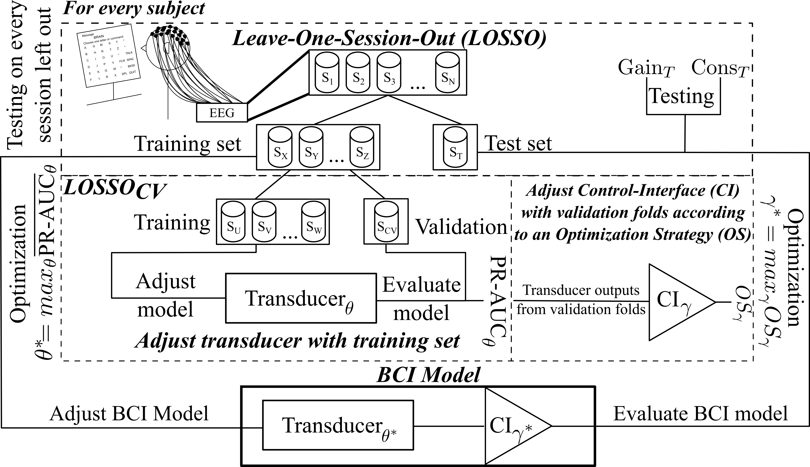

# Optimization Framework to Control the Speed–Accuracy Trade-Off of P300-based Brain–Computer Interfaces
This repository contains the scripts and results to generate figures from Jiménez J and F.B. Rodríguez work titled:

**"A Methodological Framework for Explicit Control of the Speed–Accuracy Trade-Off in Brain–Computer Interfaces" (2026)**

This work was developed and tested on a Linux system.

## Table of contents
- [Preprocessing guidelines](scripts/preproc/README.md)
- [Simulation guidelines](scripts/simulations/README.md)
- [Results formatting guidelines](scripts/reports/README.md)
- [Figures guidelines](scripts/plots/README.md)

## Optimization Framework
We propose a multi-objective optimization procedure to joinly optimize both classifiers and early-stopping strategies.
We make use of the Optuna library to choose classifiers hyperparameters by maximizing the Precision–Recall AUC.
Once optimized, early-stopping strategies were then adjusted by maximizing an optimization policy given the chosen classifier outputs.

A summary of the whole procedure is shown below.

Please note the terms *transducer* and *classifier*, as well as *control-interface* and *early-stopping strategy*, were used interchangeably.

## Repository hierarchy
Scripts were organized in five directories within the `scripts` folder:
- `preproc/*`, preprocessing scripts employed to transform raw data into preprocessed numpy arrays of epoched EEG data.
- `simulations/*`, simulation scripts, which were used to obtain all results.
- `reports/*`, formatting scripts to format output results.
- `plots/*`, scripts to draw figures shown within our paper.
- `utils/*`, utility modules implementing classes, constants, enumerations, etc, used by the simulation scripts.

Additionally, it is suggested to use the `data/*` and `results/*` directories as containers for the original datasets and the results, respectively.

> **Note**
>
> Some directories also provide Bash scripts under a folder named `bash/*`.
> These scripts are not necessary to reproduce our results, but we encourage using them to automatize the execution of Python scripts.

## How to use
You can use this code to reproduce our results or to base your research on it.
This repository contains a mixture of Python and Bash scripts, the former execute our simulations while the latter automate all experiments.
Bash scripts are not necessary to reproduce our results, but we encourage you using them as they automatize the whole process.

In case you want to perform your own analysis on our results, we also provide `*.csv` files with all our results within a compressed file called `results/results.tgz`.
Feel free to use it as you see fit for your research.

> **Note**
> 
> The provided Python scripts can be executed with a *help* flag (`-h`) to show their available execution options, for example:
> ```
> python scripts/preproc/preproc_script_hoff.py -h
> 
> usage: preproc_script_hoff.py [-h] -s {1,2,3,4,6,7,8,9} -id IN_DIR_PATH
>                          -od OUT_DIR_PATH [-el EPOCH_LEN]
>                          [-sfreq SFREQ] -es {Custom,Hoffmann 1
>                          set,Hoffmann 2 set,Hoffmann 4 set,Hoffmann 8
>                          set,Hoffmann 16 set,All}
>                          [-cs CUSTOM_SET [CUSTOM_SET ...]]
> 
> options:
>   -h, --help            show this help message and exit
>   -s {1,2,3,4,6,7,8,9}, --subject {1,2,3,4,6,7,8,9}
>                         Id of the subject to be processed
>   -id IN_DIR_PATH, --input-dir-path IN_DIR_PATH
> ...
> ```


### 1. Python environment
Create and load the Python environment with Anaconda:
```
conda env create -f environment.yml
conda activate bci_optfw
```

### 2. Include utils in path
To execute all scripts, it is necessary to include `utils` modules within your system path.

In a Linux shell:
```sh
export PYTHONPATH=scripts/utils
```

Scripts should be executed from the repository's root folder.

### 3. Datasets & Preprocessing
The following publicly P300-based available datasets are required:
- Hoffmann et al. "An Efficient P300-Based Brain–Computer Interface for Disabled Subjects" [^1] ([public data](https://www.epfl.ch/labs/mmspg/research/page-58317-en-html/bci-2/bci_datasets/)) — Rapid Serial Visual Presentation.
- Won et al. "EEG Dataset for RSVP and P300 Speller Brain-Computer Interfaces" [^2] ([public data](https://springernature.figshare.com/collections/EEG_Dataset_for_RSVP_and_P300_Speller_Brain-Computer_Interfaces/5769449/1)) — Row–Column Paradigm.

Preprocessing procedures were reproduced from original papers.
We provide two scripts to preprocess each dataset separately.

Usage:
```
python scripts/preproc/preproc_script_hoff.py -s 1 -id data/hoffmann_efficient_2008/OriginalDataEPFL -od preproc/S1 -el 1 -sfreq 32 -es "All"
```
In this example, EEG time series from Hoffmann et al. [^1] first subject (`-s 1`) are preprocessed with an epoch length of one second (`-el 1`) and downsampled to 32Hz (-sfreq 32) using all electrodes (`-es "All"`).
Won et al. dataset [^2] has its own script (`script/preproc/preproc_script_won.py`) and uses the same arguments—this last script was inspired on [these modules from the original authors](https://github.com/Kyungho-Won/EEG-dataset-for-RSVP-P300-speller/tree/main/Python).

> **Note**
>
> For more information, automated script execution, and guidelines, see [preprocessing's README](scripts/preproc/README.md).
> 
> We also provide a script to automatically download Won et al. dataset [^2] from Springer Nature, it can be executed by doing:
> ```
> python data/won_dscript.py
> ```

### 4. Execute simulations
We ran several simulations with a script called `scripts/simulations/bci_optim.py`.
This script executes the optimization framework shown on the figure above for all paradigm, policy, transducer, and control-interface combinations.

Usage:
```
python scripts/simulations/bci_optim.py -d Hoffmann -s 1 -id preproc/hoff/all -o example -os ITR -erpd LinearDiscriminantAnalysis -j -1 -t 16
```
In this example, the first subject from Hoffmann et al. [^1] experiment (`-d Hoffmann -s 1`) is optimized using all electrodes (`-id preproc/hoff/all`), the Information Transfer Rate as optimization policy (`-os ITR`), and Regularized LDA as transducer (`-erpd LinearDiscriminantAnalysis`).
Moreover, all CPU cores were assigned to work in parallel (`-j -1`) and 16 hyperparameters were assessed (`-t 16`).
This was repeated for every subject, paradigm, electrode subset, transducer, control-interface, and optimization policy.

> **Note**
> 
> The script tests all control-interfaces simultaneously, so there is no need to specify them through the arguments.
>
> For more information, automated script execution, and guidelines, see [simulation's README](scripts/simulations/README.md).

### 5. Format results
Simulations will generate at least one "\*.db" file, these are SQLite databases containing the optimization results.
These files are formatted into CSV files through `scripts/reports/optuna_bci_resfmt.py`.

Usage:
```
python scripts/reports/optuna_bci_resfmt.py -i results/Optuna/OptimCVComplete/hoff/HoffStudy.db results/Optuna/OptimCVComplete/won/WonStudy.db -o results/Optuna/OptimCVComplete/CSV/AllResults.csv
```
This example joins two "\*.db" files—*HoffStudy.db* and *WonStudy.db* (-i results/...)—into a single CSV file named *AllResults.csv* (-o .../AllResults.csv) with the obtained results.
You can add as many input files as desired, they will be all concatenated within a CSV output file.

> **Note**
>
> For more information and guidelines see [report's README](scripts/reports/README.md).

### 6. Draw figures
Figures were generated from CSV files.

Particularly, we drew 7 types of figures:
- Speed–Accuracy density maps - 2D Histograms
- Policies average trial–accuracy dots
- Win-Loss-Tie Stacked Bar-Plots
- Conditioned Stacked Bar-Plots
- Conditioned Histograms
- ITR - GCB relationship
- ITR vs. GCB - Jensen–Shannon divergences

> **Note**
>
> Usage examples, script descriptions, and plot guidelines are provided within the [plots' README](scripts/plots/README.md).

[^1]: Hoffmann, U., Vesin, J.M., Ebrahimi, T., Diserens, K., 2008. An efficient P300-based brain–computer interface for disabled subjects. Journal of Neuroscience Methods 167, 115–125. doi: [10.1016/j.jneumeth.2007.03.005](http://dx.doi.org/10.1016/j.jneumeth.2007.03.005)
[^2]: Won, K., Kwon, M., Ahn, M., Jun, S.C., 2022. EEG Dataset for RSVP and P300 Speller Brain-Computer Interfaces. Scientific Data 9, 388. doi: [10.1038/s41597-022-01509-w](http://dx.doi.org/10.1038/s41597-022-01509-w)
